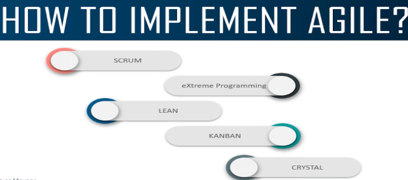

# DevSecOps

- [DevSecOps](#devsecops)
  - [SDLC](#sdlc)
    - [What is SDLC?](#what-is-sdlc)
    - [Process Of SDLC](#process-of-sdlc)
  - [Types Of SDLC Models](#types-of-sdlc-models)
    - [Waterfall Model](#waterfall-model)
    - [Agile Model](#agile-model)
      - [Agile Implementation](#agile-implementation)
    - [DevOps Model](#devops-model)
      - [What is DevOps](#what-is-devops)
      - [Why we need DevOps](#why-we-need-devops)
      - [How DevOps Works (LifeCycle Of DevOps)?](#how-devops-works-lifecycle-of-devops)
      - [DevOps Culture](#devops-culture)
      - [Adopting DevOps](#adopting-devops)
      - [Principles Of DevOps](#principles-of-devops)
      - [Framwork In DevOps](#framwork-in-devops)
      - [DevOps and Cloud-Native Development](#devops-and-cloud-native-development)
      - [DevSecOps Detailed](#devsecops-detailed)
      - [SRE](#sre)
      - [Diffrence B/W Waterfall vs Agile vs DevOps](#diffrence-bw-waterfall-vs-agile-vs-devops)
      - [Advantages and DisAdvantages](#advantages-and-disadvantages)
      - [Roles and Responsibilies](#roles-and-responsibilies)
      - [DevOps Tools](#devops-tools)
- [Kubernetes](#kubernetes)
  - [**kubernetes-Beginners**](#kubernetes-beginners)
    - [Kubernetes Basics](#kubernetes-basics)
    - [Kubernetes Overview](#kubernetes-overview)
      - [Container Orchestration](#container-orchestration)
      - [Kubernetes Advantages](#kubernetes-advantages)
    - [Kubernetes Architechture](#kubernetes-architechture)
    - [SetUp Kubernetes](#setup-kubernetes)
    - [Kubernetes Concepts - Pods, ReplicaSets, Deployments](#kubernetes-concepts---pods-replicasets-deployments)
    - [Networking in Kubernets](#networking-in-kubernets)
      - [Internal Networking](#internal-networking)
      - [Cluster Networking](#cluster-networking)
    - [Services](#services)
      - [Service Types](#service-types)
    - [MicroServices Architechture](#microservices-architechture)
      - [Deploying an application on Docker](#deploying-an-application-on-docker)
      - [Deploying an application on kubernetes cluster](#deploying-an-application-on-kubernetes-cluster)
    - [Kubernetes On Cloud](#kubernetes-on-cloud)
    - [Kubernets vs Docker Swarm](#kubernets-vs-docker-swarm)
      - [What is Kubernetes?](#what-is-kubernetes)
        - [Pros of Kubernetes](#pros-of-kubernetes)
        - [Cons of Kubernetes](#cons-of-kubernetes)
      - [What is Docker Swarm?](#what-is-docker-swarm)
        - [Pros of Docker Swarm](#pros-of-docker-swarm)
        - [Cons of Docker Swarm](#cons-of-docker-swarm)
      - [K8s vs K3s](#k8s-vs-k3s)
    - [**Kubernetes Development**](#kubernetes-development)
      - [What is Kubernets?](#what-is-kubernets)
      - [Demo App in Kubernets](#demo-app-in-kubernets)
      - [Docker Container for App](#docker-container-for-app)
      - [Kubernetes On Minikube](#kubernetes-on-minikube)
      - [Moving to Azure AKS](#moving-to-azure-aks)
      - [DevOps for Kubernetes using Azure DevOps](#devops-for-kubernetes-using-azure-devops)
      - [CI/CD Pipelines for Kubernetes using YAML pipelines](#cicd-pipelines-for-kubernetes-using-yaml-pipelines)
      - [Deploying using Helm](#deploying-using-helm)
      - [Ingress Controller](#ingress-controller)
      - [GitOps with Kubernetes](#gitops-with-kubernetes)
      - [Kubernetes NodePools](#kubernetes-nodepools)
      - [Upgrade the Cluster](#upgrade-the-cluster)
      - [Cluster backup](#cluster-backup)
    - [**Kubernetes Administration**](#kubernetes-administration)
      - [Introduction](#introduction)
      - [Core Concepts](#core-concepts)
      - [Scheduling](#scheduling)
      - [Logging and Monotoring](#logging-and-monotoring)
      - [Application Lifecycle Management](#application-lifecycle-management)
      - [Cluster Maintainance](#cluster-maintainance)
      - [Security](#security)
      - [Storage](#storage)
      - [Network](#network)
      - [Design and Install Kubernetes Cluster](#design-and-install-kubernetes-cluster)
      - [Install Kubernets hardway](#install-kubernets-hardway)
      - [End to End Test on a kubernets Cluster](#end-to-end-test-on-a-kubernets-cluster)
      - [Troubleshooting](#troubleshooting)
    - [**Kubernetes Master Course**](#kubernetes-master-course)
      - [Kubernetes Introduction](#kubernetes-introduction)
      - [Understanding the Kubernetes Architechture](#understanding-the-kubernetes-architechture)
      - [Installing and Maintaining The Kubeadm Cluster](#installing-and-maintaining-the-kubeadm-cluster)
      - [Kubernetes Core Concepts](#kubernetes-core-concepts)
      - [Workloads in Kubernetes](#workloads-in-kubernetes)
      - [Scheduling In Kubernetes](#scheduling-in-kubernetes)
      - [Configuring Application](#configuring-application)
      - [Networking In Kubernetes](#networking-in-kubernetes)
      - [Storage In Kubernetes](#storage-in-kubernetes)
      - [Security In Kubernetes](#security-in-kubernetes)
      - [Monitoring and Autoscaling kubernetes Cluster](#monitoring-and-autoscaling-kubernetes-cluster)
  
- GitLab
- OpenShift
- GitLab
- Git
- Nexus
- Prometheus, grafana and Alertmanger
- Vault
- ELK
- Linux
- IBM ACE
- MQ
- APIC and DP
- Docker
- Cri-O
- Nginx
- Apache
- Tomcat
- Maven
- Ant
- Jenkins
- UCD
- Ansible
- Eclipse
- Java
- Python
- Go
- Github
- AWS
- Bitbucket
- Junit
- Svn
- Jira
- Vs Code
- Confluence
- Nagois
- Splunk
- Release Management Tool
- Gradle
- NodeS
- Junit

--------------------------------------

## SDLC

### What is SDLC?

An SDLC goal is to develop a high quality system that meets or exceeds customer expectations, is cost effective to maintain and enhance, and works effectively in the existing and planned IT infrastructure.

In Simple Words SDLC aims for:

1. High Quality System that meets or exceeds customer expectations.
2. Cost effective to maintain and enhance.
3. Existing IT infrastructure products should work effectively.

### Process Of SDLC

1. Requirement Phase
Business analysts collect the requirement from the customer/client as per the client business needs and documents the requirement in the **Business Requirement Specification (BRS)** and provides the same to the Development team.
2. Analysis Phase
Once the requirement gathering is done the next step is to define and document the product requirement and get approved from the customer/client. This is done through the **Software Requirement Specification document (SRS)**.

Key people involved in this phase are Project manager, Business Analyst, and Senior member in the team.

The outcome of the phase is **Software Requirement Specification (SRS)**.
3. Design Phase

  1. **High Level Document (HLD)**: It gives the architecture of the software project to be developed and is done by architects and senior developers.
  2. **Low Level Document (LLD)**: It is done by Senior developers. It describes how each and every feature in the product should work and how every component should work.
  
   The Outcome of this phase is **High Level Document** and **Low Level Document**.
4. Development Phase
This phase where we start building the software and start writing the code for the product.The outcome from this phase is Source Code Document and the developed product.
5. Testing Phase
When the software is ready, it is sent to the Test team. Once the QA makes sure that the software is error-free, iit goes to the next stage, which is implementation.
The outcome of this phase is the Quality Product and the Testing Artifacts.
6. Deployment & maintenance phase
Deployment is done by the Deployment/Implementation Engineers. Once when the customers start using the developed system then the actual problem will come up and needs to be solved from time to time. Maintenance should be done as per Service Level Agreement.

## Types Of SDLC Models

### Waterfall Model

It is a linear or sequential (non-iterative) design process, used for software development. Its approach is downwards(top to down) like a waterfall. One should move to the next phase only when the preceding phase is reviewed and verified.
Eg: Mechanical Production Company


>Monolithic Architechture Followed By WaterFall Model

Most of the time, a software is a combination of different feature sets. In the monolithic architecture, all features of a software reside in a single code base, and deployed as a single file. If any code updates are required, then those updates can’t be accommodated independently. Developer has to use the same code base, make the required code changes and then re-deploy the updated code. So even if a single change is required, the whole code base is touched and re-deployed.

[What is Monolithic Architechture-1](https://www.geeksforgeeks.org/monolithic-architecture/)
[What is Monolithic Architechture-1](https://www.integrate.io/glossary/what-is-monolithic-architecture/)

[What is Microservices Archtechture-1](https://www.atlassian.com/microservices/microservices-architecture)

[What is Microservices Archtechture-2](https://www.edureka.co/blog/microservice-architecture/)

>Advantages

1. It is very simple.
2. Provides a structured way of doing this.
3. Works well for small projects where requirements are well understood beforehand.
4. Time spent early in the software development cycle can reduce cost at latter stages.

>DisAdvantages

1. Can’t change in the middle of the development.
2. Poor resource allocation (tester/deployment eng. Should sit idle until development takes place)
3. Communication Gap can result in disaster.
4. Needs a crystal clear requirement from the client (sometimes the client also wants to change his requirement).
5. No working of software will be available until all phases are finished.
6. It might be very difficult to foresee all the risks which will come in the latter stage of development.

### Agile Model

1. What is Agile?
Software development using Agile Methodology respects our rapidly changing world through adaptive planning, self-organization, and short delivery times. The methodology is flexible, fast, and aims for continuous quality improvements.

Or

However, Agile methodology differs significantly from other methodologies. In English, Agile means ‘ability to move quickly and easily’ and responding swiftly to change – this is a key aspect of Agile software development as well.

Eg: Adobe is working on a project to come up with a competing product for Microsoft Word, that provides all the features provided by Microsoft Word and any other features requested by the marketing team.


2. What are the Principles of Agile


  1. Satisfy the Customer
**"our highest priority is to satisfy the customer through early and continuous delivery of valuable software".**
By applying this concept, you will increase your process's agility and respond to changes in a timely fashion. On the other hand, your customers will be happier because they will get the value they are paying for more frequently. Also, they will be able to provide you with feedback early on, so you will be able to decrease the likelihood of making significant changes later in the process.

  2. Welcome Changing Requirement
**"welcome changing requirements, even late in development. Agile processes harness change for the customer's competitive advantage".**
In traditional project management, any late-stage changes are taken with a grain of salt as this usually means scope creep and thus higher costs. In Agile, however, teams aim to embrace uncertainty and acknowledge that even a late change can still bear a lot of value to the end customer. Due to the nature of Agile's iterative process, teams shouldn't have a problem responding to those changes in a timely fashion.

  3. Delivery Working Software Frequently
**"deliver working software frequently, from a couple of weeks to a couple of months, with a preference to the shorter timescale".**
This principle became necessary due to the extensive amounts of documentation that were part of the planning process in software development at the end of the 20th century. Logically, by taking it to heart, you will reduce the time frame for which you are planning and spend more time working on your projects. In other words, your team will be able to plan in a more agile way.

  4. Frequent Interaction With StakeHolders
**"business people and developers must work together daily throughout the project".**
In a knowledge work context that is not explicitly related to software development, you can easily change the word "developers" to "engineers" or "designers" or whatever best suits your situation. The goal is to create a synchronisation between the people who create value and those who plan or sell it. This way, you can make internal collaboration seamless and improve your process performance.

  5. Motivated Individuals
**"build projects around motivated individuals. Give them the environment and support they need, and trust them to get the job done".**
The second sentence of this principle is especially important. If you don't trust your team and keep even the tiniest decisions in your company centralized, you will only hinder your team's engagement. As a result, individuals will never feel a sense of belonging to the purpose that a given project is trying to fulfill, and you won't get the most of their potential.

  6. Face To Face Communications
**"The most efficient and effective method of conveying information to and within a development team is face-to-face conversation."**
Thankfully, with the development of technology, you can interpret this Agile principle from face-to-face to "synchronous" or otherwise direct communication. So as long as you have a way to quickly reach your team and discuss work matters without bouncing back and forward emails for days, you are good to go.

  7. Measure By Working Software
The 7th of the Agile core principles is pretty straight forward. It doesn't matter how many working hours you've invested in your project, how many bugs you managed to fix, or how many lines of code your team has written.
If the result of your work is not the way your customer expects it to be, you are in trouble.

  8. Maintain Constant Phase
**"Agile processes promote sustainable development. The sponsors, developers, and users should be able to maintain a constant pace indefinitely."**
Logically, when putting Agile to practice, your goal is to avoid overburdening and optimize the way you work so you can frequently deliver to the market and respond to change without requiring personal heroics from your team.

  9. Sustain technical Excellence and Good Design
**"continuous attention to technical excellence and good design enhances agility".**
Still, the 9th of the Agile management principles is applicable in every industry. When you maintain operational excellence, you will have less trouble reacting to changes and maintaining agility.

  10. Keep It Simple
**"Simplicity–the art of maximizing the amount of work not done–is essential".**
If you can do something in a simple way, why waste time complicating it? Your customers are not paying for the amount of effort you invest. They are buying a solution to a specific problem that they have. Keep that in mind, when implementing Agile and avoid doing something just for the sake of doing it.
  
  11. Empower Self-Organizing Teams
**"the best architectures, requirements, and designs emerge from self-organizing teams".**
If you have to push your team and "drive them forward", maybe you are not ready for Agile, or you need to make some changes to your leading style.

  12. Reflect and Adjust Continuously
**"At regular intervals, the team reflects on how to become more effective, then tunes and adjusts its behavior accordingly".**
By doing this, you will be able to experiment and improve your performance continuously. If things don't go as you've planned, you can discuss what went wrong and adjust to get back on track.

#### Agile Implementation



[Deails About Agile](https://www.youtube.com/watch?v=WjwEh15M5Rw&t=9s)

[Scrum Vs Kanban](https://www.youtube.com/watch?v=pxxmSLJj8FQ)

1. Scrum
2. Kanban

Difference B/w Agile Model and WaterFall Model
| S.no.                                                                                                                                                                    |
|--------------------------------------------------------------------------------------------------------------------------------------------------------------------------|
| Purpose                                                                                                                                                                  |
| Agile model                                                                                                                                                              |
| Waterfall model                                                                                                                                                          |
| 1.                                                                                                                                                                       |
| Definition                                                                                                                                                               |
| Agile model follows the incremental approach, where each incremental part is developed through iteration after every timebox.                                            |
| Waterfall model follows a sequential design process.                                                                                                                     |
| 2.                                                                                                                                                                       |
| Progress                                                                                                                                                                 |
| In the agile model, the measurement of progress is in terms of developed and delivered functionalities.                                                                  |
| In the waterfall model, generally the measurement of success is in terms of completed and reviewed artifacts.                                                            |
| 3.                                                                                                                                                                       |
| Nature                                                                                                                                                                   |
| Agile model is flexible as there is a possibility of changing the requirements even after starting the development process.                                              |
| On the other hand, the waterfall model is rigid as it does not allow to modify the requirements once the development process starts.                                     |
| 4.                                                                                                                                                                       |
| Customer interaction                                                                                                                                                     |
| In Agile model, there is a high customer interaction. It is because, after every iteration, an incremental version is deployed to the customer.                          |
| Customer interaction in waterfall model is very less. It is because, in a waterfall model, the product is delivered to the customer after overall development.           |
| 5.                                                                                                                                                                       |
| Team size                                                                                                                                                                |
| It has a small team size. As smaller is the team, the fewer people work on it so that they can move faster.                                                              |
| In the waterfall model, the team may consist more members.                                                                                                               |
| 6.                                                                                                                                                                       |
| Suitability                                                                                                                                                              |
| Agile model is not a suitable model for small projects. The expenses of developing the small projects using agile is more than compared to other models.                 |
| Waterfall model works well in smaller size projects where requirements are easily understandable. But waterfall model is not suitable for developing the large projects. |
| 7.                                                                                                                                                                       |
| Test plan                                                                                                                                                                |
| The test plan is reviewed after each sprint.                                                                                                                             |
| Test plan is reviewed after complete development.                                                                                                                        |
| 8.                                                                                                                                                                       |
| Testing                                                                                                                                                                  |
| Testing team can take part in the requirements change phase without problems.                                                                                            |
| It is difficult for the testing team to initiate any change in needs.                                                                                                    |

Advantages Of Agile Model:

- It is a focused client process. So, it makes sure that the client is continuously involved during every stage.
- Agile teams are extremely motivated and self-organized so it likely to provide a better result from the development projects.
- Agile software development method assures that quality of the development is maintained
- The process is completely based on incremental progress. Therefore, the client and team know exactly what is complete and what is not. This reduces risk in the development process.

Disadvantages Of Agile Method:

- It is not a useful method for small development projects.
- It requires an expert to take important decisions in the meeting.
- Cost of implementing an agile method is little more compared to other development methodologies.
- The project can easily go off track if the project manager is not clear what outcome he/she wants.

### DevOps Model

DevOps speeds delivery of higher quality software by combining and automating the work of software development and IT operations teams.

#### What is DevOps

A compound of development (Dev) and operations (Ops), DevOps is the union of people, process and technology to continually provide value to customers.

DevOps enables formerly siloed roles—development, IT operations, quality engineering and security—to coordinate and collaborate to produce better, more reliable products. By adopting a DevOps culture along with DevOps practices and tools, teams gain the ability to better respond to customer needs, increase confidence in the applications they build and achieve business goals faster.

#### Why we need DevOps

Teams that adopt DevOps culture, practices and tools become high-performing, building better products faster for greater customer satisfaction. This improved collaboration and productivity is also integral to achieving business goals like these:

1. Accelerating time to market
2. Adapting to the market and competition
3. Maintaining system stability and reliability
4. Improving the mean time to recovery

#### How DevOps Works (LifeCycle Of DevOps)?


The DevOps lifecycle (sometimes called the continuous delivery pipeline, when portrayed in a linear fashion) is a series of iterative, automated development processes, or workflows, executed within a larger, automated and iterative development lifecycle designed to optimize the rapid delivery of high-quality software. The name and number of workflows can differ depending on whom you ask, but they typically boil down to these six:

- Planning (or ideation). In this workflow, teams scope out new features and functionality in the next release, drawing from prioritized end-user feedback and case studies, as well as inputs from all internal stakeholders. The goal in the planning stage is to maximize the business value of the product by producing a backlog of features that when delivered produce a desired outcome that has value.

- Development. This is the programming step, where developers test, code, and build new and enhanced features, based on user stories and work items in the backlog. A combination of practices such as test-driven development (TDD), pair programming, and peer code reviews, among others are common. Developers often use their local workstations to perform the “inner loop” of writing and testing code before sending it down the continuous delivery pipeline.

- Integration (or build, or continuous Integration and continuous delivery (CI/CD). As noted above, in this workflow the new code is integrated into the existing code base, then tested and packaged into an executable for deployment. Common automation activities include merging code changes into a “master” copy, checking out that code from a source code repository, and automating the compile, unit test and packaging into an executable. Best practice is to store the output of the CI phase in a binary repository, for the next phase.

- Deployment (usually called continuous deployment). Here the runtime build output (from integration) is deployed to a runtime environment - usually a development environment where runtime tests are executed for quality, compliance and security. If errors or defects are found, developers have a chance to intercept and remediate any problems before any end users see them. There are typically environments for development, test, and production, with each environment requiring progressively “stricter” quality gates. A good practice for deployment to a production environment is typically to deploy first to a subset of end users, and then eventually to all users once stability is established.

- Operations. If getting features delivered to a production environment is characterized as “Day 1”, then once features are running in production “Day 2” operations occur. Monitoring feature performance, behavior, and availability ensures that the features are able to provide value add to end users. Operations ensures that features are running smoothly and that there are no interruptions in service - by making sure the network, storage, platform, compute and security posture are all healthy! If something goes wrong, operations ensures incidents are identified, the proper personnel are alerted, problems are determined, and fixes are applied.

- Learning (sometimes called continuous feedback). This is the gathering of feedback from end users and customers on features, functionality, performance and business value to take back to planning for enhancements and features the next release. This would also include any learning and backlog items from the operations activities, that could empower developers to proactively avoid any past incidents that could happen again in the future. This is the point where the “wraparound” to the Planning phase happens and we “continuously improve!”

Three other important continuous workflows occur between these workflows:

- Continuous testing:  Classical DevOps lifecycles include a discrete “test” phase that occurs between integration and deployment. However, DevOps has advanced such that certain elements of testing can occur in planning (behavior-driven development), development (unit testing, contract testing), integration (static code scans, CVE scans, linting), deployment (smoke testing, penetration testing, configuration testing), operations (chaos testing, compliance testing), and learning (A/B testing). Testing is a powerful form of risk and vulnerability identification and provides an opportunity for IT to accept, mitigate, or remediate risks.

- Security: While waterfall methodologies and agile implementations 'tack on' security workflows after delivery or deployment, DevOps strives to incorporate security from the start (Planning) - when security issues are easiest and least expensive to address - and continuously throughout the rest of the development cycle. This approach to security is referred to as shifting left (which is easier to understand if you look Figure 1). Some organizations have had less success shifting left than others, which led to the rise of DevSecOps (see below).

- Compliance. Regulatory compliance (governance and risk) are also best addressed early and throughout the development lifecycle. Regulated industries are often mandated to provide a certain level of observability, traceability and access of how features are delivered and managed in their runtime operational environment. This requires planning, development, testing, and enforcement of policies in the continuous delivery pipeline and in the runtime environment. Auditability of compliance measures is extremely important for proving compliance to 3rd party auditors.


1. Manage: DevOps closes the loop and incorporates feedback and learnings from the entire lifecycle into your ongoing iteration.

2. Plan: DevOps describes the work that needs to be done, prioritize it, and track its completion.

3. Create: DevOps writes code, proposes changes, and discusses these proposals with coworkers.

4. Verify: DevOps automatically tests code to make sure it works correctly.

5. Package: DevOps stores the software in a state where it can be reused later.

6. Secure: DevOps checks whether the software contains vulnerabilities through static and dynamic tests, fuzz testing, and dependency scanning.

7. Release: DevOps deploys the software to end users.

8. Configure: DevOps manages infrastructure and software platforms.

9. Monitor: DevOps sees the impact of the software is on infrastructure and users. It also provides data to help effectively respond to incidents.

10. Protect: DevOps secures the infrastructure the software is running on by ensuring containers are up to date and locked down.

#### DevOps Culture

It's generally accepted that DevOps methods can't work without a commitment to DevOps culture, which can be summarized as a different organizational and technical approach to software development.

At the organizational level, DevOps requires continuous communication, collaboration and shared responsibility among all software delivery stakeholders - software development and IT operations teams for certain, but also security, compliance, governance, risk and line-of-business teams - to innovate quickly and continually, and to build quality into software from the start.

In most cases the best way to accomplish this is to break down these silos and reorganize them into cross-functional, autonomous DevOps teams that can work on code projects from start to finish - planning to feedback - without making handoffs to, or waiting for approvals from, other teams. When put in the context of agile development, the shared accountability and collaboration are the bedrock of having a shared product focus that has a valuable outcome.

At the technical level, DevOps requires a commitment to automation that keeps projects moving within and between workflows, and to feedback and measurement that enable teams to continually accelerate cycles and improve software quality and performance.

  1. Collaboration, visibility and alignment
  2. Shifts in scope and accountability
  3. Shorter release cycles
  4. Continuous learning

**Benifits:**

The business value of DevOps and the benefits of a DevOps culture lies in the ability to improve the production environment in order to deliver software faster with continuous improvement. You need the ability to anticipate and respond to industry disruptors without delay. This becomes possible within an Agile software development process where teams are empowered to be autonomous and deliver faster, reducing work in progress. Once this occurs, teams are able to respond to demands at the speed of the market.

There are some fundamental concepts that need to be put into action in order for DevOps to function as designed, including the need to:

- Remove institutionalized silos and handoffs that lead to roadblocks and constraints, particularly in instances where the measurements of success for one team is in direct odds with another team’s key performance indicators (KPIs).

- Implement a unified tool chain using a single application that allows multiple teams to share and collaborate. This will enable teams to accelerate delivery and provide fast feedback to one another.

#### Adopting DevOps

Habits are hard to break. Teams entrenched in siloed ways of working can struggle with, or even be resistant to, overhauling team structures to embrace DevOps practices. Some teams may mistakenly believe new tools are sufficient to adopt DevOps. Yet, DevOps is a combination of people, tools, and culture. Everyone on a DevOps team must understand the entire value stream — from ideation, to development, to the end user experience. It requires breaking down silos in order to collaborate throughout the product lifecycle.

Moving from a legacy infrastructure to using Infrastructure as Code (IaC) and microservices can offer faster development and innovation, but the increased operational workload can be challenging. It’s best to build out a strong foundation of automation, configuration management, and continuous delivery practices to help ease the load.

An over-reliance on tools can detract teams from the necessary foundations of DevOps: the team and organization structure. Once a structure is established, the processes and team should come next and the tools should follow.

Adopting DevOps first requires a commitment to evaluating and possibly changing or removing any teams, tools, or processes your organization currently uses. It means building the necessary infrastructure to give teams the autonomy to build, deploy, and manage their products without having to rely too heavily on external teams.

- A DevOps culture is where teams embrace new ways of working that involve greater collaboration and communication. It’s an alignment of people, processes, and tools toward a more unified customer focus. Multidisciplinary teams take accountability for the entire lifecycle of a product.

- Organizations that do DevOps well are places where experimentation and some amount of risk-taking are encouraged. Where thinking outside the box is the norm, and failure is understood to be a natural part of learning and improving.

- Agile methodologies are immensely popular in the software industry since they empower teams to be inherently flexible, well-organized, and capable of responding to change. DevOps is a cultural shift that fosters collaboration between those who build and maintain software. When used together, agile and DevOps result in high efficiency and reliability.

#### Principles Of DevOps

The DevOps methodology comprises four key principles that guide the effectiveness and efficiency of application development and deployment. These principles, listed below, center on the best aspects of modern software development.

   1. Automation of the software development lifecycle
   2. Collaboration and communication
   3. Continuous improvement and minimization of waste
   4. Hyperfocus on user needs with short feedback loops
By adopting these principles, organizations can improve code quality, achieve a faster time to market, and engage in better application planning.

As DevOps has evolved, so has its complexity. This complexity is driven by two factors:

- Organizations are moving from monolithic architectures to microservices architectures. As DevOps matures, organizations need more and more DevOps tools per project.

- The result of more projects and more tools per project has been an exponential increase in the number of project-tool integrations. This necessitated a change in the way organizations adopted DevOps tools.

This evolution took place in following four phases:

Phase 1: Bring Your Own DevOps
In the Bring Your Own DevOps phase, each team selected its own tools. This approach caused problems when teams attempted to work together because they were not familiar with the tools of other teams.

Phase 2: Best-in-class DevOps
To address the challenges of using disparate tools, organizations moved to the second phase, Best-in-class DevOps. In this phase, organizations standardized on the same set of tools, with one preferred tool for each stage of the DevOps lifecycle. It helped teams collaborate with one another, but the problem then became moving software changes through the tools for each stage.

Phase 3: Do-it-yourself DevOps
To remedy this problem, organizations adopted Do-it-yourself (DIY) DevOps, building on top of and between their tools. They performed a lot of custom work to integrate their DevOps point solutions together. However, since these tools were developed independently without integration in mind, they never fit quite right. For many organizations, maintaining DIY DevOps was a significant effort and resulted in higher costs, with engineers maintaining tooling integration rather than working on their core software product.

Phase 4: DevOps Platform
A single-application platform approach improves the team experience and business efficiency. GitLab, The DevOps Platform, replaces DIY DevOps, allowing visibility throughout and control over all stages of the DevOps lifecycle.

By empowering all teams – Software, Operations, IT, Security, and Business – to collaboratively plan, build, secure, and deploy software across an end-to-end unified system, GitLab represents a fundamental step-change in realizing the full potential of DevOps. The DevOps Platform is a single application powered by a cohesive user interface, agnostic of self-managed or SaaS deployment. It is built on a single codebase with a unified data store, that allows organizations to resolve the inefficiencies and vulnerabilities of an unreliable DIY toolchain.

As we look ahead to software-led organizations becoming even more distributed and agile, every company will need a DevOps platform to modernize software development and delivery. By making it easier and trusted to adopt the next generation of cloud-native technologies – from microservices to serverless and eventually edge architecture – all companies will be empowered to ship software faster, at maximum efficiency, with security embedded across their end-to-end software supply chain.

#### Framwork In DevOps

[Four Frameworks in DevOps](https://www.atlassian.com/devops/frameworks)

**DevOps is associated with Agile software development because Agile practitioners promoted DevOps as a way to extend the methodology into production. The approach has even been labeled a counterculture to the IT service management practices championed in ITIL. DevOps does not have an official framework.
To hone their strategies, organizations should understand the related contexts of DevOps, Agile and Waterfall development, site reliability engineering (SRE) and SysOps, and even the variations within DevOps.**

#### DevOps and Cloud-Native Development

Cloud-native is an approach to building applications that leverage foundational cloud computing technologies. The goal of cloud-native is to enable a consistent and optimal application development, deployment, management and performance across public, private and multicloud environments.

Today, cloud-native applications are typically

- Built using microservices - loosely-coupled, independently deployable components that have their own self-contained stack, and communicate with each other via REST APIs, event streaming or message brokers.

- Deployed in containers - executable units of code that contain all the code, runtimes and operating system dependencies required to run the application. (For most organizations, 'containers' is synonymous with Docker containers, but other container types exist.)

- Operated (at scale) using Kubernetes, an open-source container orchestration platform for scheduling and automating the deployment, management and scaling of containerized applications.

By packaging and permanently fixing all OS dependencies, containers enable rapid CI/CD and deployment cycles, because all integration, testing and deployment occurs in the same environment. And Kubernetes orchestration performs the same continuous configuration tasks for containerized applications as Ansible, Puppet and Chef perform for non-containerized applications.

Most leading cloud computing providers - including AWS, Google, Microsoft Azure, and IBM Cloud - offer some sort of managed DevOps pipeline solution.

**Example:**

For example, developing and updating microservices - that is, the iterative delivery of small units of code to a small code base - is a perfect fit for DevOps rapid release and management cycles. And it would be difficult to deal with the complexity of a microservices architecture without DevOps deployment and operation. A recent IBM survey of developers and IT executives found that 78% of current microservices users expect to increase the time, money and effort they’ve invested in the architecture, and 56% of non-users are likely to adopt microservices within the next two years. To explore some of the specific microservices benefits and challenges they cited, use the interactive tool below:

#### DevSecOps Detailed

[DevSecOps-1](https://www.ibm.com/cloud/learn/devsecops)

[DevSecOps-2](https://www.redhat.com/en/topics/devops/what-is-devsecops)

#### SRE

Site reliability engineering (SRE) uses software engineering techniques to automate IT operations tasks - e.g. production system management, change management, incident response, even emergency response - that might otherwise be performed manually by systems administrators. SRE seeks to transform the classical system administrator into an engineer.

The ultimate goal of SRE is similar to the goal of DevOps, but more specific: SRE aims to balance an organization's desire for rapid application development with its need to meet performance and availability levels specified in service level agreements (SLAs) with customers and end-users.

Site reliability engineers achieve this balance by determining an acceptable level of operational risk caused by applications - called an 'error budget' - and by automating operations to meet that level.

On a cross-functional DevOps team, SRE can serve as a bridge between development and operations, providing the metrics and automation the team needs to push code changes and new features through the DevOps pipeline as quickly as possible, without 'breaking' the terms of the organizations SLAs.

[SRE-1](https://www.ibm.com/cloud/learn/site-reliability-engineering)
[SRE-2](https://www.redhat.com/en/topics/devops/what-is-sre)
[SRE-3](https://www.dynatrace.com/news/blog/what-is-site-reliability-engineering/#:~:text=Site%20reliability%20engineering%20%28SRE%29%20is%20the%20practice%20of,organizations%20create%20highly%20reliable%20and%20scalable%20software%20systems.)

#### Diffrence B/W Waterfall vs Agile vs DevOps


| **The Basis Of Comparison** |                          **Agile**                           |                          **DevOps**                          |
| :-------------------------: | :----------------------------------------------------------: | :----------------------------------------------------------: |
|        **Intention**        | A development and management approach for managing complex projects. | This is an end-to-end management process related to engineering. |
|          **Task**           |        The agile process focuses on constant changes.        |       DevOps focuses on constant testing and delivery.       |
|        **Practices**        | Some of the best practices adopted in Agile are listed below –   1. Building a backlog 2. Sprint development 3. Daily Scrums | DevOps also have some best practices that ease the process –   1. Respond to changes quickly 2. Collaborate directly with users and incorporate their feedback 3. Focus on technical excellence. |
|   **Speed of Production**   | Agile pertains largely to the way development is carried of; any department of the company can be agile in its practices. This can be achieved through training. | DevOps focuses more on software deployment choosing the most reliable and safest route. |
|      **Team Skillset**      | All the team members working in an agile practice have a wide variety of similar skill sets. This is one of the advantages of having such a team because, in the time of need, any of the team members can lend assistance rather than waiting for the team leads or any specialist interference. | DevOps has a different approach and is quite effective; most of the time, it follows “Divide and Conquer”. Work divided among the development and operation teams. |
|        **Team Size**        | Agile believes in “smaller and concise”. The smaller the team better it would be to deliver with fewer complexities. | DevOps, on the other hand, believes that “bigger is better”. |
|       **Scheduling**        | Since Agile teams are short, a predetermined amount of time is there, which are sprints. Hardy, it happens that a sprint has lasted longer than a month but often a week long. | DevOps, on the other hand, prioritizes reliabilities. It is because of this behavior that they can focus on a long-term schedule that minimizes business disturbances. |
|      **Shortcomings**       | In Agile, the gap between these teams is bridged in daily scrum calls where all the rollbacks are discussed and resolved with agile-scrum methodologies. | DevOps helps to bridge the line between several cross-functional teams (Development, QA, Monitoring, Deployment, Management etc.) by simplifying the process. |
|       **Advantages**        | *Customer satisfaction is there as there is the short and continuous delivery of small chunks of working applications.* People and interactions are preferred over processes and tools. *Working software is delivered at frequent timings.* Daily interaction among business people and developers. *Late changes are welcomed.*Agile prefers face to face communication over any other medium. | *Faster solutions* Improved performances *Increased efficiency* Continuous improvement *Improved customer experience.* Faster ROI * Reduced failures and rollbacks. |
|      **Disadvantages**      | *If there are some big projects, there can be issues in handling the efforts required at the initial stages of development.* The project can get out of the track if the client or the representatives are not clear with their needs. * No place for a newbie as the Agile works is based on the level of expertise. So there are lesser chances for newcomers. | * Infrastructure changes *No control over the evolution of the products that the services depend on.* A Complexity level, in some instances, has a steep curve. These can be in terms of cost, performance, deployment, and Operations. |

[Head to head Comparision b/w agile and devops](https://www.educba.com/agile-vs-devops/)


How does DevOps relate to both waterfall and agile methodologies?

- DevOps leverages and enhances the beneficial aspects of agile
- It brings your development and operations teams together
- DevOps facilitates automation to speed up procedures and eliminate human errors
- It can handle complex projects at lower risks
- Through constant feedback and removal of siloed work practices, DevOps solves problems at faster intervals
- It makes continuous delivery possible by providing customers with quick but effective small updates

How does DevOps relate to the software development lifecycle?

DevOps is not limited to software developers who write code, operations teams who handle service quality, or IT departments who deal with the IT operations.

It also impacts other areas of your organization, such as project management teams.

In fact, an effective and seamless project management practice is necessary to keep software projects on schedule and to make improvements whenever needed.

So, how does DevOps affect the software development lifecycle?

1. It applies agile principles to project management.
2. It lends itself to using microservices.
3. It results in an evolution in project planning.
4. It encourages the usage of the same tools across teams.
5. It accelerates the development of a Minimum Viable Product (MVP).

#### Advantages and DisAdvantages

[In-Short-Real-Time-DevOps-Issues](https://www.orientsoftware.com/blog/advantages-and-disadvantages-of-devops/)

Advantages:

1. events, documented management processes and detailed reports are easy to track;
2. developers have more control over the environment, giving the infrastructure a more applied understanding of the product and its operation processes;
3. a significant reduction in time to market through a seamless development and deployment cycle;
4. improved customer satisfaction;
5. improved product quality and reliability;
6. increased productivity and efficiency;
7. rapid response and high speed of experiments;
8. expanding developer competencies and responsibilities – programmers are involved in server setup and bug finding, writing automated tests, smoothing out possible infrastructure vulnerabilities in the code. This reduces the number of errors during application deployment by about 5 times.

DisAdvantages:

1. Cycle incompleteness – important stages of software life, such as requirements development and analysis, as well as architecture design, remain overboard the Devops processes. It is also possible to miss manual testing, which may be critical in some cases. For example, if developers have not analyzed the requirements properly enough and tested the product from the point of view of “ideal” code rather than from the point of view of users, the result may be inconvenient to use.
2. Insufficient professionalism of the participants, who understand everything (development, testing, deployment, support), but superficially.
3. High management load – if developers and operators have no common goals, it is the fault of managers who did not organize effective interaction between teams of different specialists. To solve this problem, a new manager evaluation system based on feedback from subordinates is needed.

DevOps-As-Service Advantages and Disadvantages:

Advantages of DevOps-as-a-Service

For this reason, ordering DevOps-as-a-Service is a good choice:

1. You get immediate access to experienced DevOps engineers who can bring their expertise to your project from day one.

2. Your DevOps partner works on a variety of projects for several companies in different industries. This gives the teams invaluable R&D experience, so they can immediately tell which approaches and solutions work and which don't. This helps to save time and money while avoiding costly errors in your project.

3. A dedicated DevOps team provides developer documentation and supports your internal IT department in mastering your new DevOps tools and systems. Once again, you need to learn from the mistakes of others rather than make your own.

Disadvantages of DevOps-as-a-Service

However, this approach is not a panacea for several reasons:

1. Managing your IT infrastructure is one of the most resource-intensive areas of your business. Therefore, you need to hire a reliable partner to ensure the uninterrupted availability of your products/services.

2. In order not to reduce the security due to outsourcing, a careful assessment is imperative to ensure the security of operations.

3. Your internal IT department should have a certain level of skills and understanding of the integration between different software modules, cloud systems and custom DevOps solutions delivered by your DevOps partner. Otherwise the IT department will not be able to support the system in production.

4. Therefore, some additional training will be required. The only remedy is a long-term partnership with a DevOps service provider so that they take over all aspects of your IT operations for you.

DevOps-Methoolgy Advantages and Disadvantages:

1. It has high productivity.
2. Product release and time to market are both accelerated.
3. Process effectiveness.
4. Production cycles have been shortened.
5. Improved operational support.
6. Employees who are engaged and motivated.
7. Within the team, there is a clear product vision.
8. Deployment success rates have increased.
9. Flexibility and support have been increased.
10. Product failure is less likely.
11. Cross-skilling and self-improvement are important.
12. Improved management of the customer experience.
13. Increased the success rate of deployments.
14. Product quality has improved.
15. Increased team efficiency.

Disadvantages of DevOps-Methodologies:

1. Requires a proper mindset throughout the organization.
2. Outsourcing DevOps operations reduced business security.
3. Dealing with the legacy system is difficult.
4. Problems with the number of tools and switching between them.
5. Transitional difficulties
6. Security training for CI/CD is a separate matter.
7. Finding the right pool of DevOps expertise is difficult.

#### Roles and Responsibilies

The primary roles and responsibilities of a DevOps Engineer are:

[R-A-R-1](https://optymize.io/blog/devops-engineer-roles-responsibilities-and-benefits/)

[R-A-R-2](https://staragile.com/blog/roles-and-responsibilities-of-devops-engineer)

[R-A-R-3](https://mindmajix.com/role-of-a-devops-engineer)

[R-A-R-4](https://www.dotnettricks.com/learn/devops/roles-and-responsibilities-of-a-devops-engineer)

#### DevOps Tools

- Project planning
  - Jira
  - GitLab
  - GitHub
  - BitBucket
  - Confluence/WIKI

- Continuous Integration and Deployment Tools
  - **[Jenkins](https://jenkins.io/)** [Open Source]
  - **[Github Actions](https://github.com/marketplace?category=continuous-integration&type=actions)** [Free & Enterprise]
  - **[Gitlab CI](https://about.gitlab.com/stages-devops-lifecycle/continuous-integration/)** [Free & Enterprise]
  - **[UrbanCode Deployment](https://www.ibm.com/cloud/urbancode/deploy)**
  - Agro CD
  - Tekton

- Infrastructure & Configuration Management Tools
  
  Infrastructure Management Tool:
  - Terraform ❎
  
  VM/Container Image Management & Configuration:
  - Docker
  - Helm
  - Crio
  - Podman
  
  Configuration Management:
  - Ansible

  Secret Management:
  - Hashicorp Vault
  
  Config/Service Discovery Tools
  - Consul
  - ETCD

- Container Clustering/Orchestration Tools
  
  Contianer Orchestration:
  - Kubernetes
  - Docker Swarm
  - OpenShift

  Container Security:
  K8s Compliance Tools:
  Service Mesh Tools:
  - Istio

- App/Infrastructure Logging/Monitoring/Visualization Tools
  
  Logging:
  - ELK / EFK
  - Spulnk
  
  Monitoring:
  - Prometheus
  - Nagois
  - Zabbix
  - Dynatrace
  - Data Dog

  Visualization:
  - Grafana
  - Kibana

- Collaboration
  - Slack
  - Google
  - WebEx
  - Teams
  - Gmail/Outlook

- Source Code Management
  - **[Github](https://github.com/)** [Free & Paid]
  - **[Bitbucket](https://bitbucket.org/product)** [Free & Paid]
  - **[Gitlab](https://about.gitlab.com/)** [Free & Paid]
  - [**AWS CodeCommit**](https://aws.amazon.com/codecommit/) [Free & Paid]
  - [**Azure Repos**](https://azure.microsoft.com/en-us/services/devops/repos/) [Free & Paid]
  - [**Google Cloud Source Repositories**](https://cloud.google.com/source-repositories) [Free & Paid]

- Developer Productivity Tools
  
  Environment Setup:
  - Vagrant [Open Source]
  - Docker [Open Source]
  
  API Tools:
  - Postman
  - SoapUI
  
  IDE’s:
  - VS Code
  - Eclips
  - Notepad ++
  
- DevOps Build Tools
  - IBM ACE
  - IBM MQ
  - JAVA
  - Python
  - NodeJS
  - Go Lang.
  - DP and APIC
  - Gradle

- Artifact Management Tools for DevOps
  - Nexus
  - JFrog
  - NPM

- Test Automation/Performance Testing Tools
  - Selenium
  - JUnit

> Other SDLC Models: ~~Spiral~~, ~~V model~~, ~~Prototype~~

Environments:

DEV: A development environment in software and web development is a workspace for developers to make changes without breaking anything in a live environment. The development environment is often seen as a developer's “everything-goes” workspace.

QA:

1. UAT/SIT: UAT and SIT testing are the two different levels of testing in the application testing phase of QA. UAT stands for User Acceptance Testing and SIT stands for System Integration Testing. Here we compare UAT vs. SIT against one another. UAT: User Acceptance Testing Best Practices
2. Stress: Stress Testing is a type of software testing that verifies stability & reliability of software application. The goal of Stress testing is measuring software on its robustness and error handling capabilities under extremely heavy load conditions and ensuring that software doesn’t crash under crunch situations. It even tests beyond normal operating points and evaluates how software works under extreme conditions.

SandBox: a sandbox environment is an isolated virtual machine in which potentially unsafe software code can execute without affecting network resources or local applications. Cybersecurity researchers use sandboxes to run suspicious code from unknown attachments and URLs and observe its behavior.

PROD: Production is the final environment in your software development process. It is the work that it ready to be publicly available, and only the most thoroughly tested code should end up here. While most people associate the production environment with the product being live, this is not necessarily the case.

--------------------------------------

# Kubernetes

"CKA Certification Should be my first Certification"

## **kubernetes-Beginners**

### Kubernetes Basics

Before knowing k8s, we need to know the containers and before knowing containers we need to have knowledge on difference b/w the legacy system and container based systems

And Here we are talking about containers. So, we are taking the most popular tool called **Docker**.

### Kubernetes Overview

#### Container Orchestration


So we learned about containers and we now have our application packaged into a docker container. But what next? How do you run it in production? What if your application relies on other containers such as database or messaging services or other backend services? What if the number of users increase and you need to scale your application? You would also like to scale down when the load decreases.

To enable these functionalities you need an underlying platform with a set of resources. The platform needs to orchestrate the connectivity between the containers and automatically scale up or down based on the load. This whole process of automatically deploying and managing containers is known as Container Orchestration.

Kubernetes is thus a container orchestration technology. There are multiple such technologies available today
– Docker has its own tool called Docker Swarm.

- Kubernetes from Google and Mesos from Apache. While Docker Swarm is really easy to set up and get started, it lacks some of the advanced auto scaling features required for complex applications.

- Mesos on the other hand is quite difficult to set up and get started, but supports many advanced features.

- Kubernetes - arguably the most popular of it all – is a bit difficult to setup and get started but provides a lot of options to customise deployments and supports deployment of complex architectures. Kubernetes is now supported on all public cloud service providers like GCP, Azure and AWS and the kubernetes project is one of the top ranked projects in Github.

#### Kubernetes Advantages


There are various advantages of container orchestration. Your application is now highly available as hardware failures do not bring your application down because you have multiple instances of your application running on different nodes. The user traffic is load balanced across the various containers. When demand increases, deploy more instances of the application seamlessly and within a matter of seconds and we have the ability to do that at a service level. When we run out of hardware resources, scale the number of nodes up/down without having to take down the application. And do all of these easily with a set of declarative object configuration files.

And THAT IS Kubernetes. It is a container Orchestration technology used to orchestrate the deployment and management of 100s and 1000s of containers in a clustered environment. Don’t worry if you didn’t get all of what was just said, in the upcoming lectures we will take a deeper look at the architecture and various concepts surrounding kubernetes.

### Kubernetes Architechture

Before we head into setting up a kubernetes cluster, it is important to understand some of the basic concepts. This is to make sense of the terms that we will come across while setting up a kubernetes cluster.


Let us start with Nodes. A node is a machine – physical or virtual – on which kubernetes is installed. A node is a worker machine and this is where containers will be launched by kubernetes.

It was also known as Minions in the past. So you might hear these terms used interchangeably.

But what if the node on which our application is running fails? Well, obviously our application goes down. So you need to have more than one node.

-> Cluster


A cluster is a set of nodes grouped together. This way even if one node fails you have your application still accessible from the other nodes. Moreover having multiple nodes helps in sharing load as well.

-> Master


Now we have a cluster, but who is responsible for managing the cluster? Where is the information about the members of the cluster stored? How are the nodes monitored? When a node fails how do you move the workload of the failed node to another worker node? That’s where the Master comes in. The master is another node with Kubernetes installed in it, and is configured as a Master. The master watches over the nodes in the cluster and is responsible for the actual orchestration of containers on the worker nodes.

-> Components

When you install Kubernetes on a System, you are actually installing the following components.

- An API Server,
The API server acts as the front-end for kubernetes. The users, management devices, Command line interfaces all talk to the API server to interact with the kubernetes cluster.

- An ETCD service,
Next is the ETCD key store. ETCD is a distributed, reliable key-value store used by kubernetes to store all data used to manage the cluster. Think of it this way, when you have multiple nodes and multiple masters in your cluster, etcd stores all that information on all the nodes in the cluster in a distributed manner. ETCD is responsible for implementing locks within the cluster to ensure there are no conflicts between the Masters.

- A kubelet service,
finally kubelet is the agent that runs on each node in the cluster. The agent is responsible for making sure that the containers are running on the nodes as expected.

- A Container Runtime,
The container runtime is the underlying software that is used to run containers. In our case it happens to be Docker.

- Schedulers,
The scheduler is responsible for distributing work or containers across multiple nodes. It looks for newly created containers and assigns them to Nodes.

- Controllers
The controllers are the brain behind orchestration. They are responsible for noticing and responding when nodes, containers or endpoints goes down. The controllers makes decisions to bring up new containers in such cases.

-> Master Vs Worker


So far we saw two types of servers – Master and Worker and a set of components that make up Kubernetes. But how are these components distributed across different types of servers. In other words, how does one server become a master and the other slave?

The worker node (or minion) as it is also known, is where the containers are hosted. For example Docker containers, and to run docker containers on a system, we need a container runtime installed. And that’s where the container runtime falls. In this case it happens to be Docker. This doesn’t HAVE to be docker, there are other container runtime alternatives available such as Rocket or CRIO. But throughout this course we are going to use Docker as our container runtime.

The master server has the kube-apiserver and that is what makes it a master.

Similarly the worker nodes have the kubelet agent that is responsible for interacting with the master to provide health information of the worker node and carry out actions requested by the master on the worker nodes.

All the information gathered are stored in a key-value store on the Master. The key value store is based on the popular etcd framework as we just discussed.

The master also has the controller manager and the scheduler.

There are other components as well, but we will stop there for now. The reason we went through this is to understand what components constitute the master and worker nodes. This will help us install and configure the right components on different systems when we setup our infrastructure.

And finally, we also need to learn a little bit about ONE of the command line utilities known as the **kube command line tool** or **kubectl** or **kube control** as it is also called. The kube control tool is used to deploy and manage applications on a kubernetes cluster, to get cluster information, get the status of nodes in the cluster and many other things.

- The kubectl run command is used to deploy an application on the cluster.
```sh kubectl run hello-minikube```

- The kubectl cluster-info command is used to view information about the cluster.
```sh kubectl cluster-info```

- The kubectl get pod command is used to list all the nodes part of the cluster.
```sh kubectl get nodes```

That’s all we need to know for now and we will keep learning more commands throughout this course. We will explore more commands with kubectl when we learn the associated concepts. For now just remember the run, cluster-info and get nodes commands and that will help us get through the first few labs.

### SetUp Kubernetes


There are lots of ways to set up Kubernetes. We can set it up ourselves locally on our laptops or virtual machines using solutions like Minikube and Kubeadmin. Minikube is a tool used to set up a single instance of Kubernetes in an All-in-one setup and kubeadm is a tool used to configure kubernetes in a multi-node setup. We will look more into that in a bit.

There are also hosted solutions available for setting up kubernetes in a cloud environment such as GCP and AWS. We will also have some demos around those.

And finally if you don’t have the resources or if you don’t want to go through the hassle of setting it all up yourself, and you simply want to get your hands on a kubernetes cluster instantly to play with, checkout play-with-k8s.com . I also have a demo on this.

So feel free to choose the one that is right for you. You need not go through all the demos, pick the ones that best suit your needs based on your time and resources.

-> Minikube Intallation


We will start with Minikube which is the easiest way to get started with Kubernetes on a local system. If Minikube is not of interest to you, now would be a good time to skip this lecture. Before we head into the demo it’s good to understand how it works. Earlier we talked about the different components of Kubernetes that make up a Master and worker nodes such as the api server, etcd key value store, controllers and scheduler on the master and kubelets and container runtime on the worker nodes. It would take a lot of time and effort to setup and install all of these various components on different systems individually by ourlselves.

Minikube bundles all of these different components into a single image providing us a pre-configured single node kubernetes cluster so we can get started in a matter of minutes.

The whole bundle is packaged into an ISO image and is available online for download.

Now you don’t HAVE to download it yourself. Minikube provides an executable command line utility that will AUTOMATICALLY download the ISO and deploy it in a virtualization platform such as Oracle Virtualbox or Vmware fusion. So you must have a Hypervisor installed on your system. For windows you could use Virtualbox or Hyper-V and for Linux use Virtualbox or KVM.

And finally to interact with the kubernetes cluster, you must have the kubectl kubernetes command line tool also installed on your machine. So you need 3 things to get this working, you must have a **hypervisor** installed, **kubectl** installed and **minikube** executable installed on your system.

`Install MiniKube: https://kubernetes.io/docs/tasks/tools/install-minikube/`

`VirtualBox: https://www.virtualbox.org/wiki/Downloads`

`MiniKube Download page for  Windows: https://github.com/kubernetes/minikube/releases`

While using Minikube with  Virtualization technologies, specify the --vm-driver option like this:
```sh $ minikube start --vm-driver=<driver_name>```

`More about it here: https://kubernetes.io/docs/setup/learning-environment/minikube/#specifying-the-vm-driver`

-> Kubeadm Installation


With the minikube utility you could only setup a single node kubernetes cluster. The kubeadmin tool helps us setup a multi node cluster with master and workers on separate machines. Installing all of these various components individually on different nodes and modifying the configuration files to make it work is a tedious task. Kubeadmin tool helps us in doing all of that very easily.

Let’s go through the steps:


1. First, you must have multiple systems or virtual machines created for configuring a cluster. We will see how to setup up your laptop to do just that if you are not familiar with it. Once the systems are created, designate one as master and others as worker nodes.

2. The next step is to install a container runtime on the hosts. We will be using Docker, so we must install Docker on all the nodes.

3. The next step is to install kubeadmin tool on all the nodes. The kubeadmin tool helps us bootstrap the kubernetes solution by installing and configuring all the required components in the right nodes.

4. The next step is to initialize the Master server. During this process all the required components are installed and configured on the master server.That way we can start the cluster level configurations from the master server.

5. Once the master is initialized and before joining the worker nodes to the master, we must ensure that the network pre-requisites are met. A normal network connectivity between the systems is not SUFFICIENT for this. Kubernetes requires a special network between the master and worker nodes which is called as a POD network. We will learn more about this network in the networking section later in this course. For now we will simply follow the instructions available to get this installed and setup in our environment.

6. The last step is to join the worker nodes to the master node. We are then all set to launch our application in the kubernetes environment.

### Kubernetes Concepts - Pods, ReplicaSets, Deployments

-> PODS


Before we head into understanding PODs, we would like to assume that the following have been setup already. At this point, we assume that the application is already developed and built into Docker Images and it is available on a Docker repository like Docker hub, so kubernetes can pull it down. We also assume that the Kubernetes cluster has already been set up and is working. This could be a single-node setup or a multi-node setup, doesn’t matter. All the services need to be in a running state.

As we discussed before, with kubernetes our ultimate aim is to deploy our application in the form of containers on a set of machines that are configured as worker nodes in a cluster. However, kubernetes does not deploy containers directly on the worker nodes. The containers are encapsulated into a Kubernetes object known as PODs. A POD is a single instance of an application. A POD is the smallest object, that you can create in kubernetes.


Here we see the simplest of simplest cases where you have a single node kubernetes cluster with a single instance of your application running in a single docker container encapsulated in a POD. What if the number of users accessing your application increases and you need to scale your application? You need to add additional instances of your web application to share the load. Now, where would you spin up additional instances? Do we bring up a new container instance within the same POD? No! We create a new POD altogether with a new instance of the same application. As you can see we now have two instances of our web application running on two separate PODs on the same kubernetes system or node.

What if the user base FURTHER increases and your current node has no sufficient capacity? Well THEN you can always deploy additional PODs on a new node in the cluster. You will have a new node added to the cluster to expand the cluster’s physical capacity. SO, what I am trying to illustrate in this slide is that PODs usually have a one-to-one relationship with containers running your application. To scale UP you create new PODs and to scale down you delete PODs. You do not add additional containers to an existing POD to scale your application. Also, if you are wondering how we implement all of this and how we achieve load balancing between containers etc, we will get into all of that in a later lecture. For now we are ONLY trying to understand the basic concepts.

-> Multi Container Pod


Now we just said that PODs usually have a one-to-one relationship with the containers, but, are we restricted to having a single container in a single POD? No! A single POD CAN have multiple containers, except for the fact that they are usually not multiple containers of the same kind. As we discussed in the previous slide, if our intention was to scale our application, then we would need to create additional PODs. But sometimes you might have a scenario where you have a helper container, that might be doing some kind of supporting task for our web application such as processing a user entered data, processing a file uploaded by the user etc. and you want these helper containers to live alongside your application container. In that case, you CAN have both of these containers part of the same POD, so that when a new application container is created, the helper is also created and when it dies the helper also dies since they are part of the same POD. The two containers can also communicate with each other directly by referring to each other as ‘localhost’ since they share the same network namespace. Plus they can easily share the same storage space as well.

--> More About Pod


If you still have doubts in this topic (I would understand if you did because I did the first time I learned these concepts), we could take another shot at understanding PODs from a different angle. Let’s, for a moment, keep kubernetes out of our discussion and talk about simple docker containers. Let’s assume we were developing a process or a script to deploy our application on a docker host. Then we would first simply deploy our application using a simple docker run python-app command and the application runs fine and our users are able to access it. When the load increases we deploy more instances of our application by running the docker run commands many more times. This works fine and we are all happy. Now, sometime in the future our application is further developed, undergoes architectural changes and grows and gets complex. We now have new helper containers that helps our web applications by processing or fetching data from elsewhere.

These helper containers maintain a one-to-one relationship with our application container and thus, needs to communicate with the application containers directly and access data from those containers. For this we need to maintain a map of what app and helper containers are connected to each other, we would need to establish network connectivity between these containers ourselves using links and custom networks, we would need to create shareable volumes and share it among the containers and maintain a map of that as well. And most importantly we would need to monitor the state of the application container and when it dies, manually kill the helper container as well as its no longer required. When a new container is deployed we would need to deploy the new helper container as well.

With PODs, kubernetes does all of this for us automatically. We just need to define what containers a POD consists of and the containers in a POD by default will have access to the same storage, the same network namespace, and the same fate as if they will be created together and destroyed together.

Even if our application didn’t happen to be so complex and we could live with a single container, kubernetes still requires you to create PODs. But this is good in the long run as your application is now equipped for architectural changes and scale in the future.

Let us now look at how to deploy PODs:

- Earlier we learned about the kubectl run command. What this command really does is it deploys a docker container by creating a POD.
- So it first creates a POD automatically and deploys an instance of the nginx docker image. But where does it get the application image from?
- For that you need to specify the image name using the –-image parameter.
- The application image, in this case the nginx image, is downloaded from the docker hub repository.
- Docker hub as we discussed is a public repository where the latest docker images of various applications are stored.
- You could configure kubernetes to pull the image from the public docker hub or a private repository within the organisation.

Now that we have a POD created, how do we see the list of PODs available? The kubectl get PODs command helps us see the list of pods in our cluster. In this case we see the pod is in a ContainerCreating state and soon changes to a Running state when it is actually running.

Also remember that we haven’t really talked about the concepts on how a user can access the nginx web server. And so in the current state we haven’t made the web server accessible to external users. You can access it internally from the Node through. For now we will just see how to deploy a POD and in a later lecture once we learn about networking and services we will get to know how to make this service accessible to end users.

The smallest unit you can create in Kubernetes object model is:

- **Pod**

-> YAML In Kubernetes


In the previous lecture we learned about YAML files in general. Now we will learn how to develop YAML files specifically for Kubernetes. Kubernetes uses YAML files as input for the creation of objects such as **PODs, Replicas, Deployments, Services** etc. All of these follow a similar structure. A kubernetes definition file always contains 4 top level fields. The **apiVersion, kind, metadata and spec**. These are top level or root level properties. Think of them as siblings, children of the same parent. These are all REQUIRED fields, so you MUST have them in your configuration file.

- The first one is the apiVersion. This is the version of the kubernetes API we’re using to create the object. Depending on what we are trying to create we must use the RIGHT apiVersion. For now since we are working on PODs, we will set the apiVersion as v1. Few other possible values for this field are apps/v1beta1, extensions/v1beta1 etc. We will see what these are for later in this course.

- Next is the kind. The kind refers to the type of object we are trying to create, which in this case happens to be a POD. So we will set it as a Pod. Some other possible values here could be ReplicaSet or Deployment or Service, which is what you see in the kind field in the table on the right.

- The next is metadata. The metadata is data about the object like its name, labels etc. As you can see, unlike the first two where you specified a string value, this is in the form of a dictionary.
  - So everything under metadata is intended to the right a little bit and so names and labels are children of metadata. The number of spaces before the two properties name and labels doesn’t matter, but they should be the same as they are siblings.
  - In this case labels have more spaces on the left than name and so it is now a child of the name property instead of a sibling. Also the two properties must have MORE spaces than its parent, which is metadata, so that its intended to the right a little bit.
  - In this case all 3 have the same number of spaces before them and so they are all siblings, which is not correct. Under metadata, the name is a string value
  - so you can name your POD myapp-pod
  - and the label is a dictionary. So labels is a dictionary within the metadata dictionary. And it can have any key and value pairs as you wish.
  - For now I have added a label app with the value myapp. Similarly you could add other labels as you see fit which will help you identify these objects at a later point in time. Say for example there are 100s of PODs running a front-end application, and 100’s of them running a backend application or a database, it will be DIFFICULT for you to group these PODs once they are deployed.
  - If you label them now as front-end, back-end or database, you will be able to filter the PODs based on this label at a later point in time.
  - It’s IMPORTANT to note that under metadata, you can only specify name or labels or anything else that kubernetes expects to be under metadata.
  - You CANNOT add any other property as you wish under this. However, under labels you CAN have any kind of key or value pairs as you see fit.
  - So it's IMPORTANT to understand what each of these parameters expect.
  - So far we have only mentioned the type and name of the object we need to create which happens to be a POD with the name myapp-pod, but we haven’t really specified the container or image we need in the pod.
  - The last section in the configuration file is the specification which is written as spec. Depending on the object we are going to create, this is where we provide additional information to kubernetes pertaining to that object.
  - This is going to be different for different objects, so its important to understand or refer to the documentation section to get the right format for each. Since we are only creating a pod with a single container in it, it is easy.

- Spec is a dictionary so add a property under it called containers, which is a list or an array. The reason this property is a list is because the PODs can have multiple containers within them as we learned in the lecture earlier. In this case though, we will only add a single item in the list, since we plan to have only a single container in the POD. The item in the list is a dictionary, so add a name and image property. The value for the image is nginx.

Once the file is created, run the command kubectl create -f followed by the file name which is pod-definition.yml and kubernetes creates the pod.

```sh kubectl create -f pod-definition.yml```

So to summarise, remember the 4 top level properties. apiVersion, kind, metadata and spec. Then start by adding values to those depending on the object you are creating.

Once we create the pod, how do you see it? Use the kubectl get pods command to see a list of pods available. In this case it's just one. To see detailed information about the pod run the kubectl describe pod command. This will tell you information about the POD, when it was created, what labels are assigned to it, what docker containers are part of it and the events associated with that POD.

[POD YAML's and Practice Sets are Here](Kubernetes-Beginners/README.md/#pod-yaml)

Commands:

```sh $ kubectl run <name of pod> --image=<name of the image from registry>```

```sh $ kubectl run tomcat --image=tomcat:9```

```sh kubectl create -f pod-definition.yml```

-> **Controllers**

High Availability

So what is a replica and why do we need a replication controller?

- Let’s go back to our first scenario where we had a single POD running our application.
- What if for some reason, our application crashes and the POD fails?
- Users will no longer be able to access our application. To prevent users from losing access to our application, we would like to have more than one instance or POD running at the same time.
- That way if one fails we still have our application running on the other one. The replication controller helps us run multiple instances of a single POD in the kubernetes cluster thus providing High Availability.
- So does that mean you can’t use a replication controller if you plan to have a single POD?
- No! Even if you have a single POD, the replication controller can help by automatically bringing up a new POD when the existing one fails.
- Thus the replication controller ensures that the specified number of PODs are running at all times. Even if it’s just 1 or 100.

Load Balancing and scaling

- Another reason we need a replication controller is to create multiple PODs to share the load across them.
- For example, in this simple scenario we have a single POD serving a set of users. When the number of users increases we deploy additional POD to balance the load across the two pods.
- If the demand further increases and If we were to run out of resources on the first node, we could deploy additional PODs across other nodes in the cluster. As you can see, the replication controller spans across multiple nodes in the cluster.
- It helps us balance the load across multiple pods on different nodes as well as scale our application when the demand increases.

- It’s important to note that there are two similar terms. Replication Controller and Replica Set. Both have the same purpose but they are not the same.
- Replication Controller is the older technology that is being replaced by Replica Set.
- Replica set is the new recommended way to set up replication. However, whatever we discussed in the previous few slides remains applicable to both these technologies.
- There are minor differences in the way each works and we will look at that in a bit.

Labels and Selectors

- So what is the deal with Labels and Selectors? Why do we label our PODs and objects in kubernetes?
- Let us look at a simple scenario. Say we deployed 3 instances of our frontend web application as 3 PODs.
- We would like to create a replication controller or replica set to ensure that we have 3 active PODs at any time.
- And YES that is one of the use cases of replica sets. You CAN use it to monitor existing pods, if you have them already created, as it IS in this example. In case they were not created, the replica set will create them for you. The role of the replica set is to monitor the pods and if any of them were to fail, deploy new ones.
- The replica set is in FACT a process that monitors the pods. Now, how does the replicaset KNOW what pods to monitor. There could be 100s of other PODs in the cluster running different applications. This is where labelling our PODs during creation comes in handy.
- We could now provide these labels as a filter for replica sets. Under the selector section we use the matchLabels filter and provide the same label that we used while creating the pods. This way the replica set knows which pods to monitor.

[Controller YAML's and Practice Sets are Here](Kubernetes-Beginners/README.md/#controllers)

Commands:

```sh
# Once we change `replica: 6` field in ReplicaSet.yml 
kubectl replace -f ReplicaSet.yml
```

```sh kubectl scale --replicas=6 -f ReplicaSet.yml```

```sh kubectl scale --replicas=6 replicaset nginx-rc```

-> **Deployment**

- For a minute, let us forget about PODs and replica sets and other kubernetes concepts and talk about how you might want to deploy your application in a production environment. Say for example you have a web server that needs to be deployed in a production environment. You need not ONE, but many such instances of the web server running for obvious reasons.

- Secondly, when newer versions of application builds become available on the docker registry, you would like to UPGRADE your docker instances seamlessly.

- However, when you upgrade your instances, you do not want to upgrade all of them at once as we just did. This may impact users accessing our applications, so you may want to upgrade them one after the other. And that kind of upgrade is known as Rolling Updates.

- Suppose one of the upgrades you performed resulted in an unexpected error and you are asked to undo the recent update. You would like to be able to rollBACK the changes that were recently carried out.

- Finally, say for example you would like to make multiple changes to your environment such as upgrading the underlying WebServer versions, as well as scaling your environment and also modifying the resource allocations etc. You do not want to apply each change immediately after the command is run, instead you would like to apply a pause to your environment, make the changes and then resume so that all changes are rolled-out together.

[Deployment YAML's and Practice Sets are Here](Kubernetes-Beginners/README.md/#deployments)

Commands:

| Operation | Commands                                                      |
| --------- | ------------------------------------------------------------ |
| Create    | ```sh kubectl create -f Deployment.yml```                    |
| Get       | ```sh kubectl get po```                                      |
| Update    | ```sh kubectl apply -f  Deployment.yml```                    |
|           | ```sh kubectl set image deplloyment nginx-deploy nging=nginx:1.9.0``` |
| status    | ```sh kubectl rollout status deployment nginx-deploy```      |
|           | ```sh kubectl rollout history deployment nginx-deploy```     |
|           | ```sh kubectl rollout history deployment nginx-deploy --revision=<revision-number>``` |
| rolback   | ```sh kubectl rolllout undo deployment nginx-deploy```       |

### Networking in Kubernets

#### Internal Networking

- Lets start with a single node kubernetes cluster with a single pod and the node has an IP address say it is 192.168.1.2 in this case. This is the IP address we use to access the kubernetes node, ssh etc,.

- On a other side, if we are using minikube setup (IP address of the minikube VM inside hypervisor will be considered, laptop may be having different IP).

- In docker world, IP address is assigned to a conatiner whereas in kubernetes world IP address is always assigned to a POD.

- Each POD in the kubernetes, gets its own internal IP address.(10.244.0.2)

- When the kubernetes is initially confgured, we create an internal private network with the address 10.244.0.0 and all the pods are attached to it. When we deploy multiple PODS, they all get a separate IP addresses assigned from this network like 10.244.0.2, 10.244.0.3, 10.244.0.4.

- The PODs can communicate with each other through this IP(10.244.0.0), but accessing the other PODs using this internal IP address may not be a good idea as it subject to change when the PODs are recreated.

#### Cluster Networking

- For example, we have two nodes running kubernetes with IP addresses 192.168.1.2 and 192.168.1.3 assigned to them (note these are not part of a cluster yet). Each node has a single POD deployed. These PODs are attached to their internal network and have their own IP addresses assigned.

- However, if we observe the internal networks addresses, we can see that they are the same. The two networks have same address(10.244.0.0) and the PODs deployed have the same address too(10.244.0.2).

- This is not going to work well when the nodes are part of the same cluster. The PODs have the same IP addresses assigned to them and that leads to IP conflicts in the network. When a kubernetes cluster is setup, kubernetes does not automatically setup any kind of networking to handle this issues. As a matter of fact, kubernetes expects us to setup networking to meet certain fundamental requirements like:
  - All containers/PODs can communicate to one another without NAT (network address translation-method of remapping an IP address space to another).
  
  - All nodes can communicate with all containers and vice versa without NAT.

- We have multiple pre-build solutions available for this such as cisco SCI networks, vmware NSX, fannel, cilium etc,. Dependening on the platform we are deploying kuberenets cluster on, we can use one of these.

- kubernetes cluster on our system -- cilium, fannel are good options

- kubernetes cluster on vmware -- NSX

- With customer networking either with fannel or cilium setup, it now manages the networks and IPs in the nodes and assigns a different network address for each network in the node. This creates a virtual network of all PODs and nodes where they all assigned a unique IP address and by using simple routing techniques, the cluster networking enables communication between the differnt PODs or nodes to meet the networking requirements of kubernetes.

- Thus now all the PODs can communicate to each other using the assigned IP address.

### Services

- Service is a kubernetes object that enables various communication between various components within and outside of the application.

- Kubernetes services helps us to connect applications together with other applications or users.

- For example, our application has group of PODs running various sections such as a group for serving front-end load to users, other for running backend processes and third one connecting to external data source.

- It is services that enable connectivity between these groups of PODs.

- Services enable the front end application to be made available to users, it helps communication between backend and front end parts and helps in establishing connectivity to an external datasource.

- Thus services enable loose coupling between microservices in our application.

#### Service Types

1. NodePort: This service makes internal POD accessible on a port on the node.

2. ClusterIP: This service creates a vitrualIP inside the cluster, to enable communication between different services such as set of frontend servers to a set of backend servers.

3. LoadBalancer: This provisions a load balancer for our application in supported cloud providers.

-> Create a service -- Nodeport


Among ports, port is only one which is mandatory. If we dont provide target port, by default target port is assumed to be same as port. If we dont provide nodePort, the free port between range **30000-32767** will be assigned as nodeport.

Now we can access the POD using curl
```sh curl http://192.168.1.2:30008```
Here 192.168.1.2 is the IP address of node and 30008 is the nodeport.

If we are using minikube then:
`minikube service <servicename> --url`

-> Create a service -- ClusterIP


- A full stack application will have different types of PODs hosting different parts of an application.

- To connect different pods like frontend pods with backend pods and backend pods with database pods.

- All pods are assigned with a specific IP address, but IP addresses are not static because these PODS may go at anytime and new PODS may come into action, so we cannot rely on IP addresses for internal communication between the application.

- A kubernetes service can help group the PODs together and provide single interface to access the PODs in a group. The request will be forwarded to one of the PODs under the service randomly.

- In this case, two services will be created one for backend and one for redis for commnication.

- This enables us to easily and effectively deploy microservices based application on kubernetes cluster. Each layer can scale or move without effecting various services. Each service gets an IP and name and assigned to it inside the cluster and that it is name that to be used by other PODs to access the service. This type of service is called clusterIP.

-> Create a service -- LoadBalancer


- To make the application accessible to the external user, we create the services of type NodePort. The services of type NodePort helps in receiving the traffic on the ports of the node and routing the traffic to the respective PODs.

- When we have 4 nodes, with what url we can access the application, we can access the application with any of the 4 urls(IP address of the nodes:port).

- All the PODs of the cluster can be accessed from any node of the cluster (irrespective of the particular node in which they reside).

- The end users want a single url(not many) to access, to achieve that we can create a new VM for load balancing purpose and install and configure a suitable loadbalancer on it (like proxy) and then configure the load balancer to route traffic to the underlying nodes. This way will be tedious.

- If we were on a supported cloud platform like Google Cloud or NWS or Azure, we could leverage the native load balancer of that cloud platform. Kubernetes has support for integrating with the native load balancers of certain cloud providers and configuring that for us.

- For this, we just need to set the type as LoadBalancer.

- This will easily work only on cloud platforms because of in-build Load Balancer setup.

[Service YAML's and Practice Sets are Here](Kubernetes-Beginners/README.md/#services)

Commands:

```sh
kubectl create service-${Type}.yml

kubectl get services
```

### MicroServices Architechture

#### Deploying an application on Docker


#### Deploying an application on kubernetes cluster

-> In this application, we have

`voting-app --> redis <-- worker --> postgres --> result-app`

-> Our Goals are:

- Deploy Containers
- Enable connectivity
- Extrenal access for the users.

-> Steps:

- Deploy PODs
- We need to know what are the connectivity requirements. We need to be clear on what application requires access to what services.
- Redis database is accessed by both voting-app and worker app. The voting-app saves the vote to the redis database and worker app reads the vote from the redis database.
- Postgres database is accessed by the worker app to update it with the total count of the votes and also it is accessed by the result-app to read the total counts of votes to be displayed.
- voting-app is accessed by the external users i.e., voters and the result-app is also used by the external users to view the results.
- worker app is not being accessed by any one.


- A service is only required if the application has some kind of database or process that needs to be exposed or accessed by others.

### Kubernetes On Cloud

There are various options to deploy a kubernetes cluster on the cloud like

- Google Cloud Platform
- Amazon Web Services
- Microsoft Azure

For production purposes there are many ways to get started with the kubernetes cluster both in a private or public cloud environment.

-> Self Hosted / Turnkey Solutions

- You provison VMs
- You Configure VMs
- You use Scripts to Deploy Cluster
- You maintain VMs yourself
eg: Kubernetes on AWS using kops or KubeOne

-> Hosted Solutions (Managed Solutions)

- Kubernetes-As-A-Service
- Provider provisions VMs
- Provider installs Kubernetes
- Provider maintains VMs
eg: Google Container Engine(GKE)

### Kubernets vs Docker Swarm

#### What is Kubernetes?

[Kubernetes](https://www.ibm.com/cloud/learn/kubernetes) is developed by the community with the intent of addressing container scalability and management needs. In the early days of Kubernetes, the community contributors leveraged their knowledge of creating and running internal tools, such as Borg and Omega. With the advent of the Cloud Native Computing Foundation (CNCF) in partnership with the Linux Foundation, the community adopted Open Governance for Kubernetes. IBM, as a founding member of CNCF, actively contributes to CNCF’s [cloud-native](https://www.ibm.com/cloud/learn/cloud-native) projects, along with other companies like Google, Red Hat, Microsoft, and Amazon.

Kubernetes is an open source container-management tool for those important containers and their complex production workloads. With Kubernetes, developers and DevOps teams can schedule, deploy, manage, and discover highly available apps by using the flexibility of clusters. A [Kubernetes cluster](https://www.ibm.com/cloud/blog/kubernetes-clusters-architecture-for-rapid-controlled-cloud-app-delivery) is made up of compute hosts that are called worker nodes. These worker nodes are managed by a Kubernetes master that controls and monitors all resources in the cluster. A node can be a virtual machine or  physical, bare metal machine.

##### Pros of Kubernetes

- [Open-source community](https://kubernetes.io/) that is very active in developing the code base
- Fast-growing KubeCon conferences throughout the year that are more than doubling attendance numbers
- Battle-tested by big players like Google and our own IBM workloads and runs on most operating systems
- Largest adoption in the market
- Available on the public cloud or for on-premises — managed or non-managed offerings from all the big cloud providers (IBM Cloud, AWS, Microsoft Azure, Google Cloud Platform, etc.)
- Broad Kubernetes support from an ecosystem of cloud tool vendors, such as Sysdig, LogDNA, and Portworx (among many others)
- Key functionalities include service discovery, [ingress](https://www.ibm.com/cloud/blog/kubernetes-ingress) and [load balancing](https://www.ibm.com/cloud/learn/load-balancing), self-healing, storage orchestration, horizontal scalability, automated rollouts and rollbacks, and batch execution
- Unified set of APIs and strong guarantees about the cluster state

##### Cons of Kubernetes

- Management of the Kubernetes master takes specialized knowledge
- Updates from open source community are frequent and require careful patching in order to avoid disrupting workloads
- Too heavyweight for individual developers to set up for simplistic apps and infrequent deployments
- Often need additional tools (e.g., kubectl CLI), services, continuous integration/continuous deployment (CI/CD) workflows and other DevOps practices to fully manage access, identity, governance and security

#### What is Docker Swarm?

Docker Swarm is another open-source container orchestration platform that has been around for a while. Swarm —or more accurately, *swarm mode* — is Docker’s native support for orchestrating clusters of [Docker](https://www.ibm.com/cloud/learn/docker) engines. A Swarm cluster consists of Docker Engine deployed Swarm manager nodes (which orchestrate and manage the cluster) and worker nodes (which are directed to execute tasks by the manager nodes).

##### Pros of Docker Swarm

- Built for use with the Docker Engine (Docker is a container platform used for building and deploying containerized applications)
- Has its own Swarm API
- Smoothly integrates with Docker tools like Docker Compose and Docker CLI (uses the same command line interface (CLI) as Docker Engine)
- Tools, services, and software that run with Docker containers will also work well with Swarm
- Is easy to install and set up for Docker environments
- Uses a filtering and scheduling system to provide intelligent node selection, allowing you to pick the optimal nodes in a cluster for container deployment

##### Cons of Docker Swarm

- Limited customizations and extensions
- Less functionality-rich than Kubernetes
- No easy way to separate Dev-Test-Prod workloads in DevOps pipeline

Not to confuse matters too much, but [Docker Enterprise Edition now supports Kubernetes too](https://thenewstack.io/docker-fully-embraces-kubernetes/).

| Operations             | Kubernetes                                                   | Docker Swarm                                                 |
| ---------------------- | ------------------------------------------------------------ | ------------------------------------------------------------ |
| Installation and setup | No installation required for managed offerings from cloud providers. But for VM installation it is hard but widely used | Install it with Docker.                                      |
| Scalability            | Built-in with horizontal auto-scaling.                       | Auto-scaling groups.                                         |
| Load balancing         | Discovery of services through a single DNS name. Access to container applications through IP address or HTTP route. | Internal load balancers.                                     |
| High availability      | Self-healing and intelligent scheduling. High availability of services through replication. | Use Swarm Managers for availability controls.                |
| Deployment             | **Both Docker Swarm and Kubernetes provide a means to apply rolling updates and for rolling back those updates as required** | **Docker Swarm deployments are considered much more user-friendly than Kubernetes** |
| Service Discovery      | **Both Docker Swarm and Kubernetes provide DNS based service discovery**. | **Both Docker Swarm and Kubernetes provide DNS based service discovery**. |
| Performance            | Therefore, **applications deployed with Docker Swarm and Kubernetes will operate with similar speed and efficiency**. | **Docker Swarm will deploy and start containers as much as five times more quickly than Kubernetes** and **Docker Swarms ability to respond to API calls much more quickly** |

The main reason we have chosen Kubernetes over Docker Swarm is related to the following artifacts:

- **Key features:** Easy and flexible installation, Clear dashboard, Great scaling operations, Monitoring is an integral part, Great load balancing concepts, Monitors the condition and ensures compensation in the event of failure.
- **Applications:** An application can be deployed using a combination of pods, deployments, and services (or micro-services).
- **Functionality:** Kubernetes as a complex installation and setup process, but it not as limited as Docker Swarm.
- **Monitoring:** It supports multiple versions of logging and monitoring when the services are deployed within the cluster (Elasticsearch/Kibana (ELK), Heapster/Grafana, Sysdig cloud integration).
- **Scalability:** All-in-one framework for distributed systems.
- **Other Benefits:** Kubernetes is backed by the Cloud Native Computing Foundation (CNCF), huge community among container orchestration tools, it is an open source and modular tool that works with any OS.

#### K8s vs K3s

| K8s                                                          | K3s                                                          |
| ------------------------------------------------------------ | ------------------------------------------------------------ |
| Kubernetes uses kubelet, an agent running on each Kubernetes node to perform a control loop of the containers running on that node. This agent runs inside the container. However, K3s does not use kubelet, but it runs kubelet on the host machine and uses the host’s scheduling mechanism to run containers. | K3s are not functionally different from K8s, but they have some differences that make them unique. K3s can deploy applications faster than kubernetes. Not only that, K3s can spin up clusters more quickly than K8s. K8s is a general-purpose container orchestrator, while K3s is a purpose-built container orchestrator for running Kubernetes on bare-metal servers. |
| Kubernetes or K8s can host [workloads](<https://www.delltechnologies.com/en-in/learn/cloud/cloud-workloads.htm#:~:text=A> cloud workload is a,are all considered cloud workloads.) running across multiple environments, while K3s can only host workloads running in a single cloud. It mainly happens because K3s don’t contain the capacity to maintain a significant workload on multiple clouds as it is small in size. | Again, we can see that K3S is lightweight because of its small size, and this helps it run [clusters](<https://www.vmware.com/topics/glossary/content/kubernetes-cluster#:~:text=A> Kubernetes cluster is a,dependences and some necessary services.&text=Kubernetes clusters allow containers to,based%2C and on-premises.) in IoT devices such as [Raspberry Pi](https://www.raspberrypi.org/), which has limited resources. In contrast, we can see that normal Kubernetes or K8s is not operable in IoT or edge computing devices. Also, K3s supports both ARM64 and ARMv7 with binaries. |
| At the same time, we can see that Kubernetes, due to its heavy size, takes advantage of hosting workloads and spin up clusters in multiple clouds. K3s is a standalone server, unlike K8s, which is a part of the Kubernetes cluster. K8s relies on CRI-O to integrate Kubernetes with CRI (Container Runtime Interface) while K3s uses CRI-O, and therefore is compatible with all of the supported container runtimes. K8s uses kubelet to schedule containers, but K3s uses the host’s scheduling mechanism to schedule containers. | K3s uses [kube-proxy](<https://kubernetes.io/docs/concepts/overview/components/#:~:text=kube-proxy> is a network,or outside of your cluster.) to proxy the network connections of the Kubernetes nodes, but K8s uses kube-proxy to proxy the network connections of an individual container. It also uses kube-proxy to set up IP masquerading, while K3s does not use kube-proxy to do that. |
| Again, K8s uses [kubelet](<https://kubernetes.io/docs/reference/command-line-tools-reference/kubelet/#:~:text=The> kubelet is the primary,object that describes a pod.) to watch the Kubernetes nodes for changes in the configuration, while K3s does not watch Kubernetes nodes for changes in the configuration. Instead, it receives a deployment manifest containing the configuration information from the Kubernetes control plane and makes changes accordingly. | k3s can have [tighter security](https://sysdig.com/blog/k3s-sysdig-falco/) deployment than k8s because of their small attack surface area. Another advantage of k3s is that it can reduce the dependencies and steps needed to install, run or update a Kubernetes cluster. |
| Kubernetes can be very beneficial when it comes to [orchestration](https://www.redhat.com/en/topics/containers/what-is-container-orchestration) (arrangement and coordination of automated tasks) of large databases as it can maintain the load of the database. At the same time, k3s can be more than useful for small databases. It happens to come in a single binary file of less than 100 MB, which will help to fire up quick clusters, faster scheduling pods and other tasks. |                                                              |

--------------------------------------

### **Kubernetes Development**

#### What is Kubernets?

#### Demo App in Kubernets

#### Docker Container for App

#### Kubernetes On Minikube

#### Moving to Azure AKS

#### DevOps for Kubernetes using Azure DevOps

#### CI/CD Pipelines for Kubernetes using YAML pipelines

#### Deploying using Helm

#### Ingress Controller

#### GitOps with Kubernetes

#### Kubernetes NodePools

#### Upgrade the Cluster

#### Cluster backup

### **Kubernetes Administration**

#### Introduction

#### Core Concepts

#### Scheduling

#### Logging and Monotoring

#### Application Lifecycle Management

#### Cluster Maintainance

#### Security

#### Storage

#### Network

#### Design and Install Kubernetes Cluster

#### Install Kubernets hardway

#### End to End Test on a kubernets Cluster

#### Troubleshooting

AND

### **Kubernetes Master Course**

#### Kubernetes Introduction

#### Understanding the Kubernetes Architechture

#### Installing and Maintaining The Kubeadm Cluster

#### Kubernetes Core Concepts

#### Workloads in Kubernetes

#### Scheduling In Kubernetes

#### Configuring Application

#### Networking In Kubernetes

#### Storage In Kubernetes

#### Security In Kubernetes

#### Monitoring and Autoscaling kubernetes Cluster
